# ND1 피지컬 AI 전문가 과정 - M8 PBL 실습 리포트

**작성일**: 2026-06-27  
**개발 환경**: Ubuntu 22.04 LTS / ROS2 Humble / Gazebo / RViz2  

---

## 0. 시뮬레이션 환경 구성 및 플랫폼 전환

### TurtleBot4 시뮬레이션 환경 구동 및 플랫폼 전환
실습 초기 단계에서 TurtleBot4(Gazebo Ignition/Fortress) 환경을 정상적으로 구동하여 가제보 및 시뮬레이션을 성공적으로 실행했습니다(아래 3개 이미지). 다만, 시뮬레이터 구동 시 발생하는 물리 렌더링 부하와 리소스 소모가 커 일반적인 실습 진행에 어려움이 있다고 판단하여, 이후 실습 과정은 경량화된 **TurtleBot3(Gazebo Classic)** 플랫폼으로 전환하여 진행하였습니다.

| TurtleBot4 구동 화면 1 | TurtleBot4 구동 화면 2 |
| --- | --- |
| 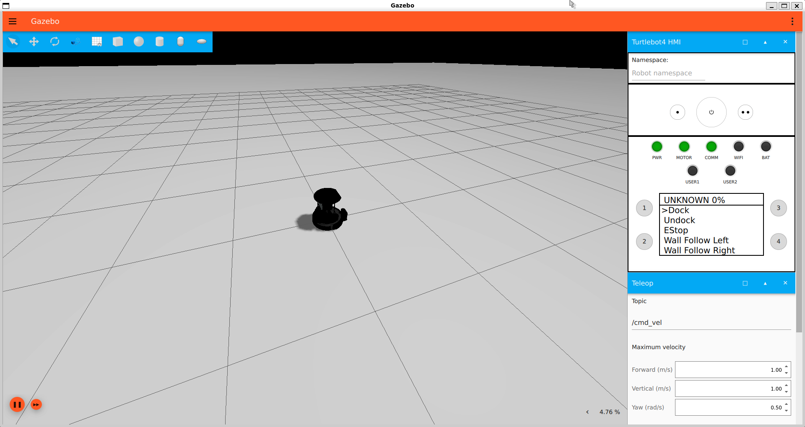 | 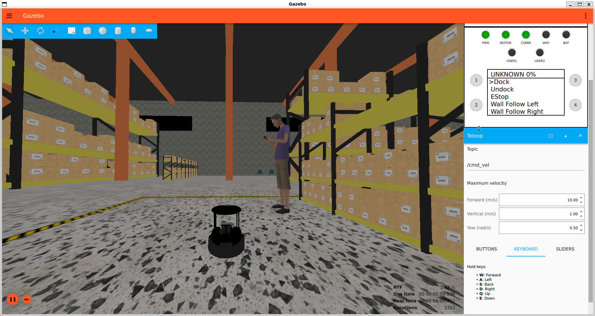 |

| TurtleBot4 구동 화면 3 |
| --- |
| 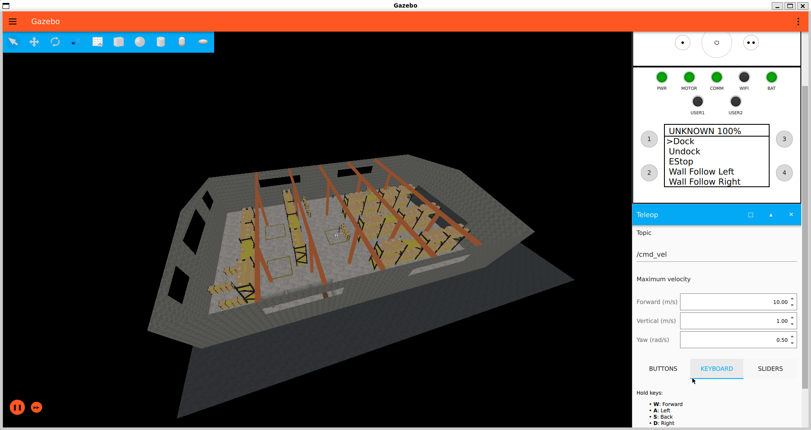 |

---

## 1. CP0 - Turtlesim 정사각형 주행 (워밍업)
- **개발 코드**: `cp0_square_mover.py`
- **주요 내용**: 
  - ROS2 노드 간의 기본 토픽 발행 및 구독 원리를 학습하기 위해 `turtlesim` 노드와 연동하는 정사각형(Square) 주행을 구현했습니다.
  - 일정한 전진 주행 타이밍(forward ticks)과 $90^\circ$ 회전 타이밍(turn ticks)을 타이머 콜백 루프를 기반으로 실시간으로 세밀하게 카운트하여 제어했습니다.
- **결과**: 총 3바퀴 완주 후 안정적으로 노드가 자동 종료되며 성공적으로 제어 루프를 동작시켰습니다.

| Turtlesim 정사각형 주행 완료 화면 |
| --- |
| 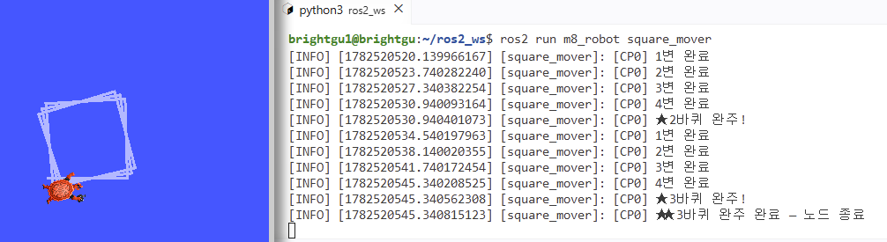 |

---

## 2. CP1 - robot_mover (속도 제어 & 오도메트리 수신)
- **개발 코드**: `cp1_robot_mover.py`
- **주요 내용**:
  - `/cmd_vel` 토픽을 발행하는 Publisher를 생성하여 2Hz 이상의 주파수로 주기적인 속도 명령을 전송했습니다.
  - `/odom` 토픽을 구독하는 Subscriber를 구현하여 주행 중인 로봇의 실시간 Odometry 좌표를 터미널 상에 출력하는 기능을 통합했습니다.
  - 로봇의 운동 반경을 파악하기 위해 linear.x와 angular.z 속도 값을 적절히 인가하여 원형 궤적(Circular Trajectory)의 주행을 수행하고, 해당 토픽 데이터를 `rosbag2` 백(bag) 파일로 기록했습니다.
- **결과**: 노드 및 토픽의 정상적인 연결을 `rqt_graph`로 확인하고, `/odom` 좌표 피드백과 함께 가제보 상에서 로봇이 성공적으로 원 운동을 하는 것을 검증했습니다.

| TurtleBot3 원형 회전 주행 화면 | rqt_graph 토픽 연결 구조 확인 |
| --- | --- |
| 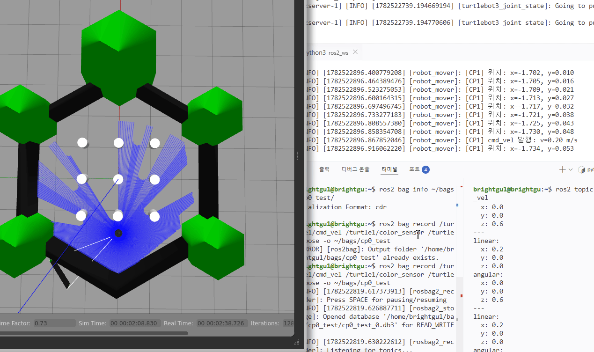 | 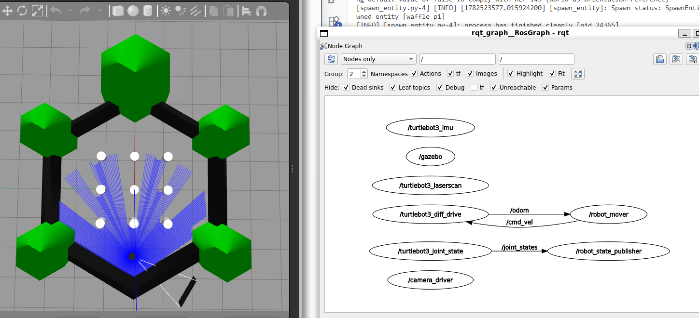 |

---

## 3. CP1 심화 - LaserScan 이상치 필터링 & 마커 시각화
- **개발 코드**: `cp1_5_sensor_filter.py`
- **주요 내용**:
  - 시뮬레이션 환경 및 실제 공간에서 라이다(Lidar) 센서가 수집한 Lidar raw 데이터 중 무한대(`inf`), 결측값(`nan`), 센서 물리적 범위(`range_min`/`range_max`)를 벗어난 데이터 등 오차가 유발되는 이상 데이터를 사전에 감지하고 필터링하도록 설계했습니다.
  - 전체 360개 스캔 각도 중 실시간으로 필터링되어 유효하게 반환되는 Lidar 측정값의 통계를 콘솔에 출력하였습니다.
  - RViz2와의 직관적인 데이터 결합을 위해 `visualization_msgs/MarkerArray` 형식으로 감지된 장애물 좌표를 구형(Sphere) 마커로 정적 변환 후 `/obstacle_markers` 토픽을 통해 실시간 발행했습니다.
- **결과**: 불필요한 노이즈 데이터는 소거하고, 실시간으로 장애물 표면 및 외벽 라인을 따라 RViz2 상에 빨간색 마커들이 유효하게 매핑 및 시각화되었습니다.

| RViz2 상의 LaserScan 필터링 마커 표시 화면 |
| --- |
| 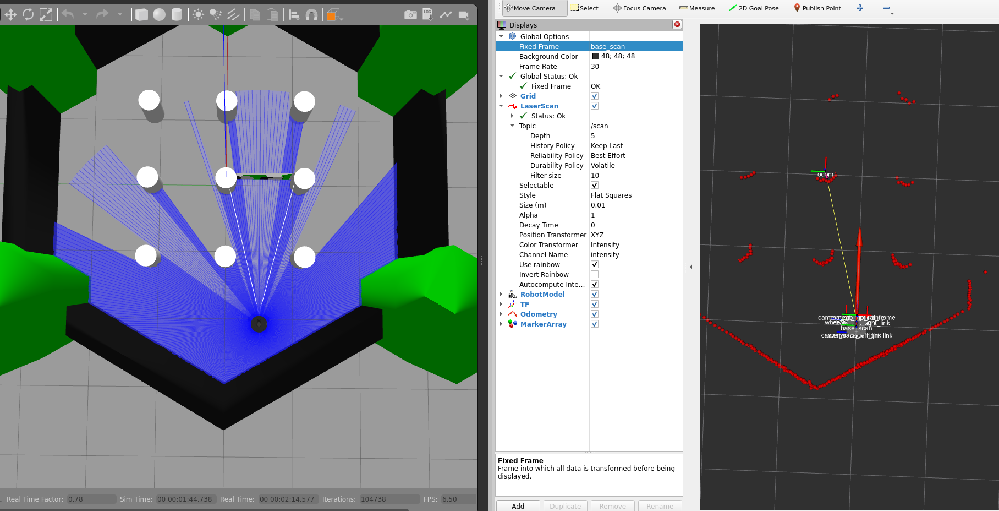 |

---

## 4. CP2 - SLAM 지도 생성
- **개발 코드**: `slam_toolbox` 연동 & `cp2_slam_mapper.py`
- **주요 내용**:
  - 미로 형태의 맵(`maze world`)에서 `slam_toolbox` 패키지를 동작시킨 후, 키보드 조작(`teleop_twist_keyboard`) 노드를 사용하여 로봇의 주행 속도를 제한(선속도 $0.2\,\text{m/s}$ 이하)하며 부드럽고 꼼꼼하게 미로 영역 전반을 맵핑했습니다.
  - `/map` 토픽의 그리드 셀 정보(Occupancy Grid)를 연산하여 지도 영역 내의 unknown(-1) 영역을 배제하고 이동 가능한 자유 영역(free cells)의 상대적 점유 비중인 **커버리지 비율(Coverage Ratio)**을 실시간 모니터링 노드를 통해 수신했습니다.
  - 커버리지 통계 수치가 합격 기준선인 **70%**를 도과함을 감지한 후 `map_saver_cli` 도구를 실행해 지도 파일(`my_map.yaml` 및 `my_map.pgm`)로 로컬 환경에 온전히 저장했습니다.
- **결과**: 목표 커버리지(70%+) 조건을 초과 달성하여 자율 주행에 필수적인 고밀도 그리드 지도를 획득했습니다.

| SLAM Toolbox 실시간 지도 구성 과정 | 완성된 SLAM 2D 점유 격자 지도 |
| --- | --- |
| 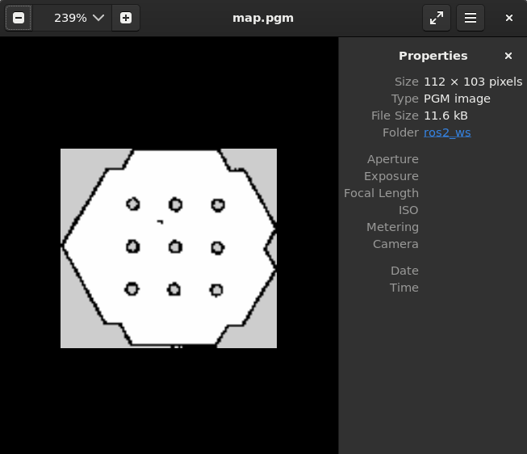 | 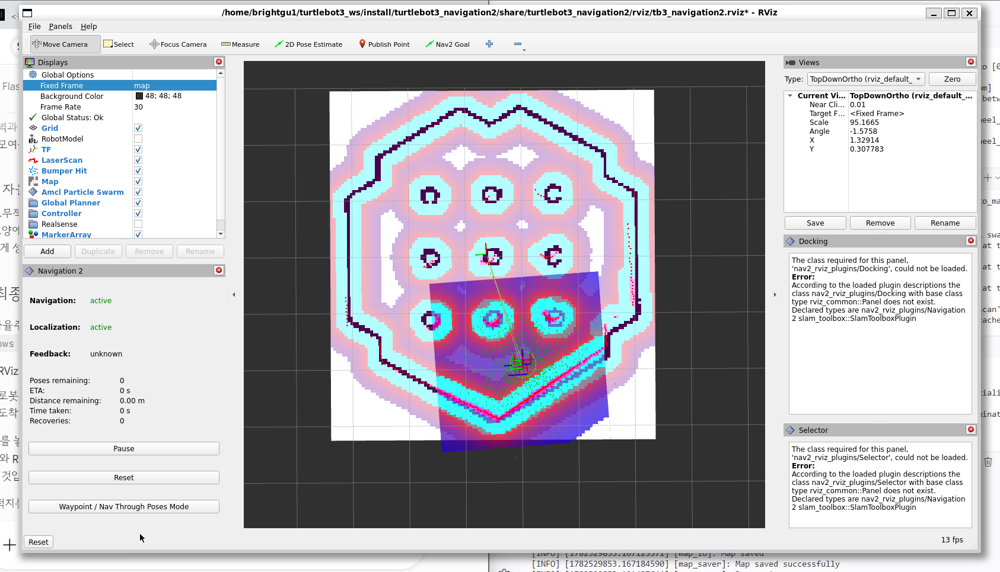 |

---

## 5. CP3 - Nav2 다중 목표점 자율 주행
- **개발 코드**: `cp3_nav2_client.py`
- **주요 내용**:
  - 획득 완료된 지도의 흰색 영역(충돌 확률이 매우 낮은 안전 주행 가능 구역)을 분석하여 총 3개의 경유지(Goal Points)를 산정하였습니다.
  - Nav2 `NavigateToPose` 액션 클라이언트를 비동기 통신 모델로 프로그래밍하여 각 경유지에 대해 순차 이동 지령을 내렸습니다.
  - `MultiThreadedExecutor` 구조와 서브 스레드를 결합하여 주행 피드백(목표점까지의 남은 거리 등)을 막힘없이 수신하고 다음 목표로 유연하게 핸드오버할 수 있도록 비동기 콜백을 병렬화하였습니다.
  - TF 프레임 일치를 위해 헤더 타임스탬프(`header.stamp`)를 최신 시간값으로 동적으로 업데이트해 목표 거절 오류를 사전에 제거했습니다.
- **주행 목표 지점**:
  
  | 목표 | X 좌표 (m) | Y 좌표 (m) | Yaw 각도 (rad) |
  | :---: | :---: | :---: | :---: |
  | **목표 1** | `0.09` | `-0.05` | `0.0` |
  | **목표 2** | `2.44` | `2.39` | `0.0` |
  | **목표 3** | `3.89` | `-0.08` | `0.0` |

- **결과**: 각 3개의 목적지에 안전하고 순차적으로 접근 완료하여 자율 주행 시퀀스를 성공적으로 끝마쳤습니다.

| Nav2 2D Pose 초기 위치 입력 화면 | Nav2 자율주행 최종 완료 시연 (3.8MB GIF) |
| --- | --- |
| 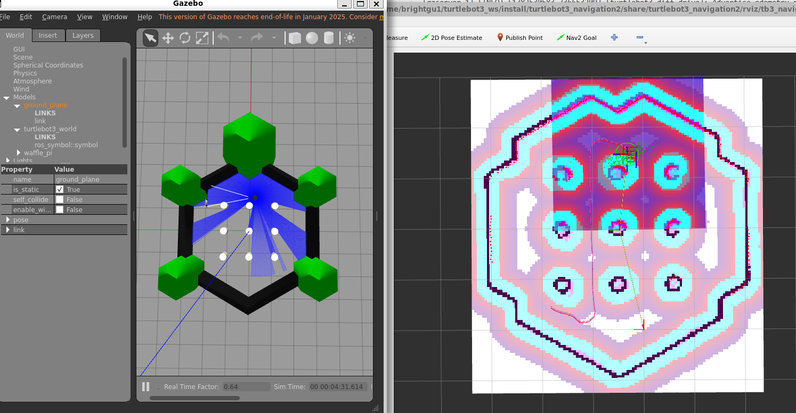 | 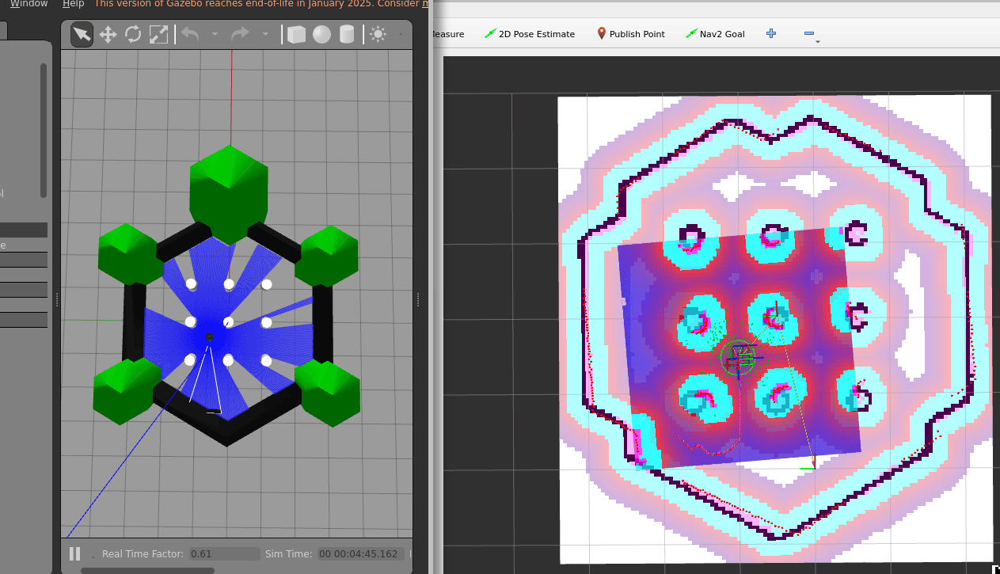 |

---

## 6. M7 → M8 로봇 팔 IK 연동 브릿지 (추가 사항)
- **개발 코드**: `m7_to_ros2_bridge.py`
- **주요 내용**:
  - 이전 단계(M7 모듈)에서 구현했던 3-DOF 평면 머니퓰레이터의 수치적 역기하학(numerical IK - Damped Least Squares법) 해와 현재의 ROS2 시스템을 결합했습니다.
  - 주어진 다중 말단 위치(End-effector Targets: `[0.55, 0.20]`, `[0.40, 0.40]`, `[0.00, 0.70]`)에 맞춰 산출한 관절각 각도($\theta_1, \theta_2, \theta_3$)를 계산하고, 이를 ROS2 표준 메시지 `sensor_msgs/JointState`로 20Hz 주기로 퍼블리시하여 RViz2 상에 실시간 3D 매니퓰레이터 팔로 시각화했습니다.
  - 추가적으로 물리 모터 제어를 위해 `trajectory_msgs/JointTrajectory` 궤적 커맨드 형태로 변환하여 Gazebo 내 제어기에 부드러운 위치 제어 프로필을 주입할 수 있도록 인터페이스 다리를 놓았습니다.
- **결과**: 수치 역기하학 기반 조작 알고리즘과 ROS2 통합 프레임워크 간의 연동이 성공적으로 규격화되었습니다.