# M15 실습 보고서

## 실습 1, 2: SLAM 지도 작성 및 Nav2 자율주행

### 실습 개요

- **목표**: SLAM(slam_toolbox)으로 가상 환경의 2D 격자 지도를 작성하고, 저장된 지도를 기반으로 Nav2가 목표 좌표까지 자율주행하는 파이프라인을 확인한다.
- **환경**: Ubuntu(WSL2) + ROS2 Humble, Gazebo, RViz2. 새 터미널마다 `source /opt/ros/humble/setup.bash && source scripts/env.sh`를 선행 실행한다.

### 실습 실행 방법

Gazebo(`lab1_practice.py --action start-gazebo`), SLAM 노드(`lab2_start_slam_toolbox.sh`), RViz2(`lab2_start_rviz_safe.sh`), 키보드 조종(`lab2_teleop.sh`)을 각각 별도 터미널에서 실행한다. 지도 작성 후 `lab2_save_map.sh maps/lab_map`으로 저장하고, Nav2 서버(`lab3_start_nav2_official.sh maps/lab_map.yaml`) 구동 후 RViz2에서 초기 위치를 설정한 뒤 `lab3_send_goal.sh 0.5 0.0 0.0`으로 목표를 전송한다.

### 실습 주요 결과

지도 작성 후 목표 지점(x=0.5, y=0.0, yaw=0.0)으로 이동
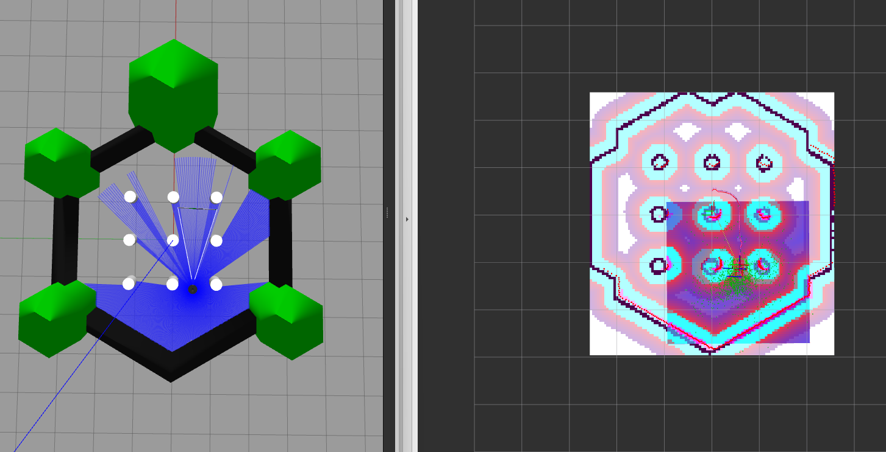

도착 확인. Gazebo 좌표계는 상하가 x축, 좌우가 y축이며, 위쪽(+x), 왼쪽(+y)이 양수이다.
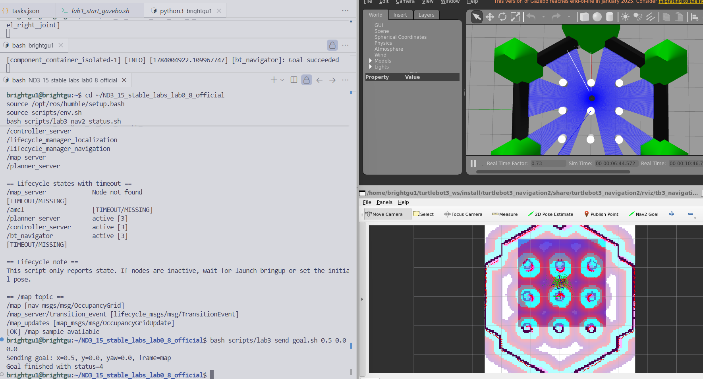

y값을 1.0으로 변경하여 y축 방향으로 이동.
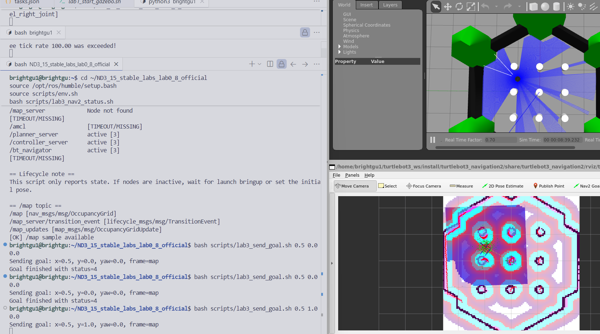

rqt_graph — 시뮬레이터, SLAM, Nav2, 센서 노드들의 연결 구조를 확인하였다.
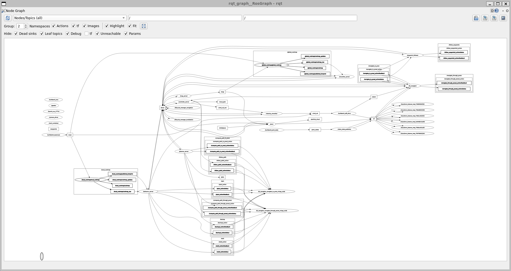

---

## 실습 6: Rosbag 데이터 로깅 및 재현

### 실습 개요

- **목표**: 자율주행 중 ROS2 토픽 데이터를 `rosbag`으로 기록(Record)하고, 시뮬레이터 없이 RViz2에서 오프라인으로 재현(Play)한다.
- **환경**: Nav2 주행 중 추가 터미널로 rosbag 스크립트를 실행한다. 재생 시에는 Gazebo와 Nav2를 종료한 후 RViz2만 구동한다.

### 실습 실행 방법

Nav2 주행 중 `bash scripts/lab7_record_bag.sh`로 녹화를 시작하고, 주행 완료 후 `Ctrl+C`로 종료한다. 백 파일 정보는 `ros2 bag info results/nav2_20260714_153826`으로 확인하며, 재생 시 `ros2 bag play results/nav2_20260714_153826`을 실행한다.

### 실습 주요 결과

총 121.35초(약 2분) 분량의 주행 데이터가 SQLite3 포맷(6.3 MiB)으로 저장되었다.

| 토픽 명칭 | 데이터 유형 | 기록 개수 | 의미 |
|---|---|---|---|
| `/tf` | TFMessage | 3,678개 | 좌표계 간 동적 변환 정보 |
| `/cmd_vel` | Twist | 2,406개 | 모터 제어 명령 |
| `/odom` | Odometry | 1,996개 | 바퀴 엔코더 기반 주행 위치 |
| `/local_plan` | Path | 1,204개 | 로컬 제어기의 장애물 회피 경로 |
| `/scan` | LaserScan | 338개 | 2D LiDAR 거리 측정값 |
| `/plan` | Path | 117개 | 전역 플래너의 경로선 |
| `/amcl_pose` | PoseWithCovarianceStamped | 60개 | AMCL 위치 추정 좌표 |
| `/map` | OccupancyGrid | 1개 | 2D 점유 격자 지도 |
| `/tf_static` | TFMessage | 1개 | 로봇-센서 간 정적 구조 정보 |

> `/tf`, `/tf_static`, `/map`이 함께 저장되어 Gazebo 없이 RViz2에서 오프라인 재현이 가능하다.

rosbag 재생 — RViz2만 단독으로 실행하면 기록된 대로 움직임을 확인할 수 있다.

Gazebo와 함께 재생하면 로봇이 기록대로 움직이지 않는다.

<video controls src="results/m15_lab6_rosbag_replay_ok.mp4" width="560" title="rosbag 정상 재현 (RViz2 단독)"></video>

<video controls src="results/m15_lab6_rosbag_replay_error.mp4" width="560" title="rosbag + Gazebo 동시 재생 시 오작동"></video>

---

### Rosbag 재생 시 Gazebo 동시 실행 문제 분석

#### 1. Gazebo에서 로봇이 기록대로 움직이지 않는 이유

Gazebo는 물리 시뮬레이터로, 로봇이 움직이려면 `/cmd_vel`이 직접 입력되어야 한다. `ros2 bag play`는 과거 데이터를 ROS2 네트워크에 재발행할 뿐, Gazebo 물리 엔진에 구동력을 인가하지 못한다. 따라서 rosbag 재생 중에도 Gazebo 속 로봇은 제어 입력이 없어 정지 상태를 유지한다.

#### 2. RViz2에서 로봇이 순간이동(깜빡임)하는 이유

Gazebo와 rosbag이 동시에 실행되면 동일한 토픽(`/tf`, `/odom`)에 두 개의 데이터 소스가 충돌한다.

- **Gazebo** → 현재 위치 (0.0, 0.0) 발행
- **rosbag** → 과거 주행 위치 (1.0, 0.8) 발행

RViz2는 수신 메시지를 순서대로 화면에 반영하므로, 수 밀리초 간격으로 두 위치 데이터가 번갈아 도착하여 로봇이 순간이동하는 것처럼 표현된다.

#### 결론

rosbag 재생 시에는 Gazebo(또는 실제 로봇)를 종료한 후 RViz2만 단독으로 구동해야 한다. 데이터 소스가 중복되면 시각화 충돌과 물리 엔진 불일치가 동시에 발생한다.

---

## 실습 5: 동적 장애물 삽입 및 경로 재계획

### 실습 개요

- **목표**: 주행 경로 상에 가상 장애물(`lab_box`)을 삽입하여 Nav2 코스트맵이 이를 반영하고 우회 경로를 재생성(Dynamic Replanning)하는지 확인한다.
- **환경**: Gazebo와 Nav2(lab_map.yaml)가 실행된 상태에서 추가 터미널로 장애물 생성 및 목표 좌표를 전송한다.

### 실습 실행 방법

`python3 scripts/lab6_practice.py --action spawn --x 0.5 --y 0.0 --z 0.25 --model lab_box`로 장애물을 생성한 후, `bash scripts/lab3_send_goal.sh 1.05 1.50 0.0`으로 목적지를 지정한다. 실습 후 `lab6_practice.py --action delete --model lab_box`로 장애물을 제거한다.

### 실습 주요 결과

lab_box 생성 후 주행 명령 — 코스트맵에 장애물이 반영되고 우회 경로가 생성되는 과정.
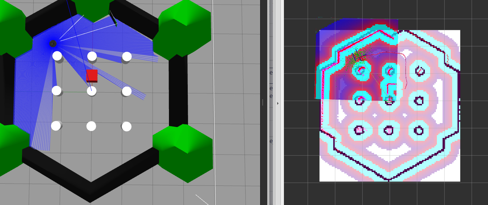
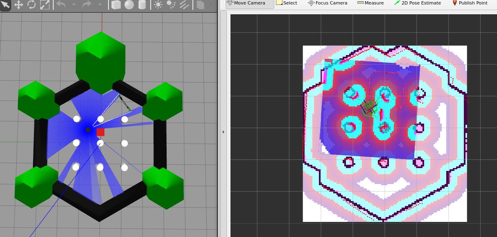

> LiDAR로 장애물이 감지되면 코스트맵에 충돌 불가 구역이 표시되고, 로컬 플래너가 우회 경로를 재계획하여 목적지에 도달(`Goal succeeded`)하였다.

---

## 실습 3: 전역 경로 계획 알고리즘 비교

### 실습 개요

- **목표**: Dijkstra, A\*, Weighted A\*, Greedy, RRT 알고리즘을 동일한 지도에서 실행하고, 계획 시간·경로 길이·확장 노드 수를 비교한다.
- **환경**: Gazebo 없이 저장된 지도(`lab_map.yaml`)를 스크립트에 직접 입력하여 오프라인으로 측정한다.

### 실습 실행 방법

`python3 scripts/lab4_practice.py --map maps/lab_map.yaml --start-x -0.95 --start-y -1.5 --goal-x 0.8 --goal-y 1.6 --algorithms dijkstra astar weighted_astar greedy rrt`로 알고리즘별 경로 계획을 수행한다. 종합 벤치마크는 `bash scripts/lab4_planner_offline_md.sh`로 실행한다.

### 실습 주요 결과

**실험 1** — 시작점 (-0.95, -1.5) → 도착점 (0.8, 1.6)

| 알고리즘 | 계획 시간 | 경로 길이 | 확장 노드 수 |
|---|---|---|---|
| Dijkstra | 79.359 ms | 3.825 m | 6,901개 |
| A\* | 11.452 ms | 3.825 m | 1,141개 |
| Weighted A\* | 0.720 ms | 3.825 m | 63개 |
| Greedy | 1.082 ms | 3.825 m | 63개 |
| RRT | 2.898 ms | 5.503 m | 20개 |

**실험 2** — 시작점 (-0.9, -1.5) → 도착점 (1.1, 1.8)

| 알고리즘 | 계획 시간 | 경로 길이 | 확장 노드 수 |
|---|---|---|---|
| Dijkstra | 71.012 ms | 4.128 m | 7,467개 |
| A\* | 11.687 ms | 4.128 m | 1,268개 |
| Weighted A\* | 0.711 ms | 4.128 m | 67개 |
| Greedy | 0.643 ms | 4.294 m | 68개 |
| RRT | 1.315 ms | 5.283 m | 17개 |

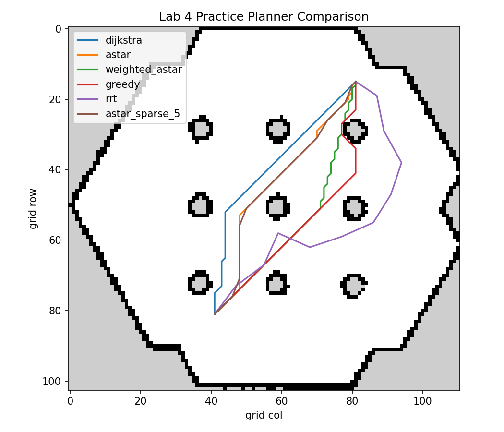

**종합 오프라인 벤치마크** — simple_map 기준 경로 비교

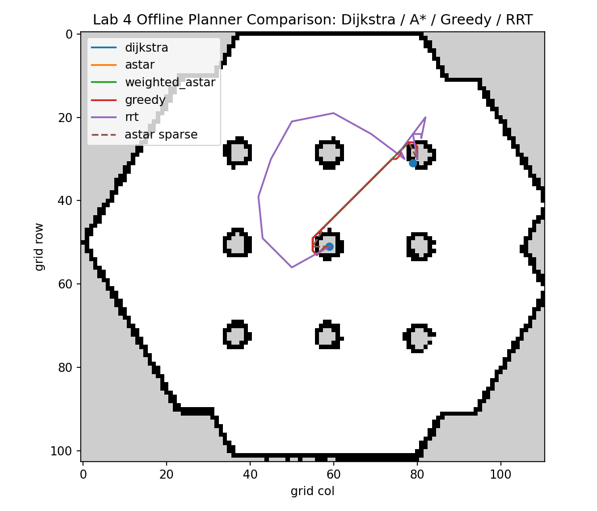

> Dijkstra와 A\*는 동일한 최단 경로를 산출하지만, A\*는 휴리스틱으로 확장 노드 수를 약 1/6로 줄여 속도가 빠르다. RRT는 무작위 샘플링 방식으로 경로 길이가 가장 길고 변동성이 크다.

---

## 실습 4: 지역 제어기(DWB) Safe vs Agile 정책 비교

### 실습 개요

- **목표**: DWB 지역 제어기의 Safe(안전 우선)와 Agile(속도 우선) 정책이 도달 시간, 위치 오차, 연산 샘플 수에 미치는 영향을 비교한다.
- **환경**: Gazebo 없이 DWB 플래너 파라미터와 주행 모델을 오프라인으로 시뮬레이션하여 측정한다.

### 실습 실행 방법

`python3 scripts/lab5_practice.py`로 기본 파라미터 비교를 수행하고, `python3 scripts/lab5_practice.py --safe-v 0.12 --safe-w 0.7 --agile-v 0.30 --agile-w 1.4 --target-x 2.0 --target-y 0.8`로 추가 실험한다. 종합 벤치마크는 `bash scripts/lab5_dwb_safe_agile_offline_md.sh`로 실행한다.

### 실습 주요 결과

**실험 1** — 기본 제어 프로필 (Safe: max_v 0.15 m/s / Agile: max_v 0.26 m/s)

| 제어 정책 | 최대 선속도 | 최대 각속도 | 도달 시간 | 최종 위치 오차 | 연산 샘플 수 | 제어 노력 |
|---|---|---|---|---|---|---|
| Safe | 0.15 m/s | 0.8 rad/s | 15.0 초 | 0.039 m | 151개 | 25.123 |
| Agile | 0.26 m/s | 1.2 rad/s | 9.6 초 | 0.039 m | 97개 | 25.272 |

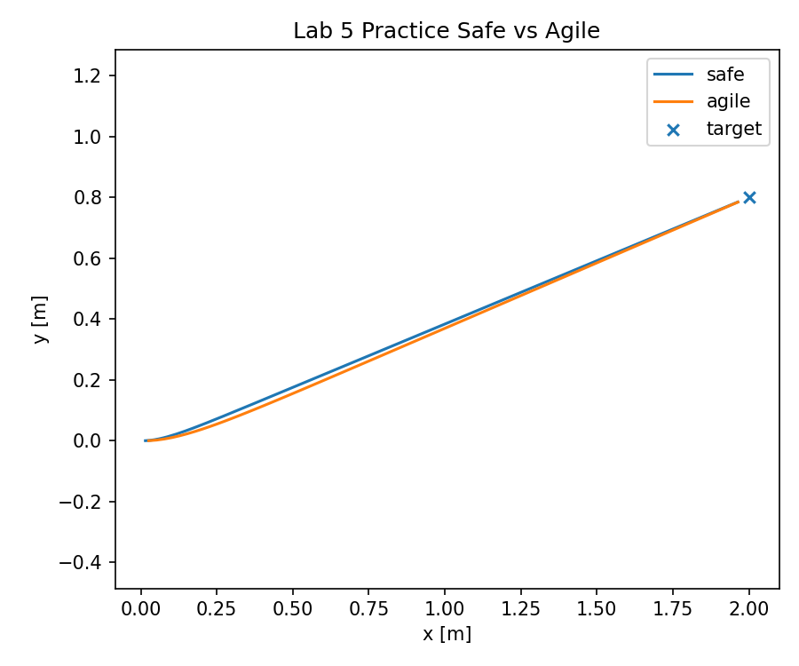

**실험 2** — 고속 프로필 (x=2.0, y=0.8)

| 제어 정책 | 최대 선속도 | 최대 각속도 | 도달 시간 | 최종 위치 오차 | 연산 샘플 수 | 제어 노력 |
|---|---|---|---|---|---|---|
| Safe | 0.12 m/s | 0.7 rad/s | 18.4 초 | 0.037 m | 185개 | 25.114 |
| Agile | 0.30 m/s | 1.4 rad/s | 8.7 초 | 0.038 m | 88개 | 25.340 |

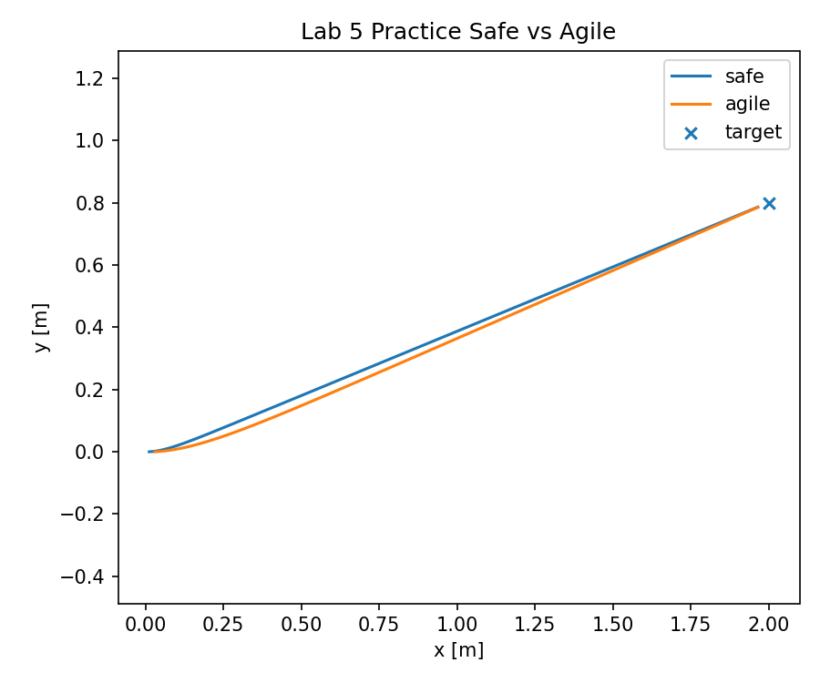

**오프라인 벤치마크** — Safe vs Agile 궤적 비교

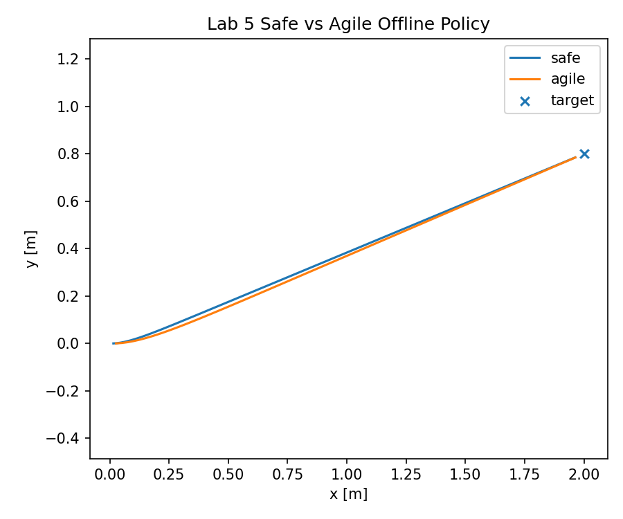

> Agile 정책은 Safe 대비 도달 시간을 36~52.7% 단축하였으며, 두 정책 모두 최종 위치 오차는 3.7~3.9cm로 유사하다.

---

## 실습 7: 다중 목표 자율주행 미션 (Waypoint Following)

### 실습 개요

- **목표**: 이전 실습에서 다룬 SLAM, 전역 플래너, 로컬 제어기, Rosbag 기술을 통합하여 3개의 목적지를 순차 주행하고 종합 보고서를 자동 생성한다.
- **환경**: Gazebo, Nav2(lab_map.yaml), RViz2가 모두 실행된 상태에서 `lab8_practice.py`로 미션을 구동한다.

### 실습 실행 방법

`python3 scripts/lab8_practice.py --mode preview --waypoints docs/waypoints_default.csv`로 파일 유효성을 사전 점검하고, `python3 scripts/lab8_practice.py --mode mission --waypoints docs/waypoints_default.csv --timeout 120`으로 미션을 실행한다. 완료 후 `bash scripts/lab8_make_report.sh`로 보고서를 생성한다.

### 실습 주요 결과

Waypoint 1(0.5, 0.0), Waypoint 2(1.0, 0.8, yaw 90°), Waypoint 3(0.0, 1.0, yaw 180°) 순차 주행 — 모두 `status=4(Succeeded)`로 완료.
<video controls src="results/m15_lab7_waypoint_mission.mp4" width="560" title="다중 웨이포인트 순차 자율주행"></video>
