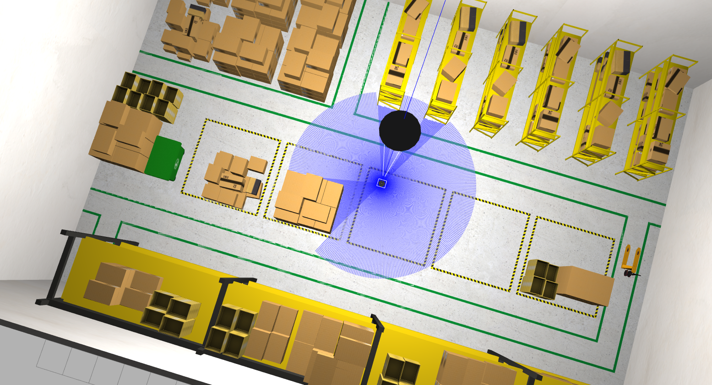
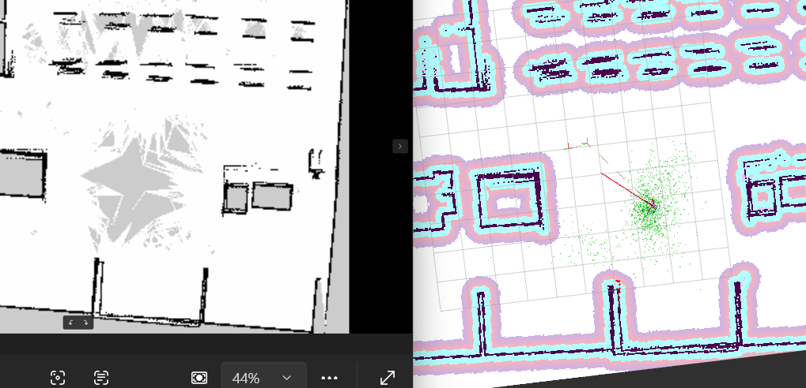
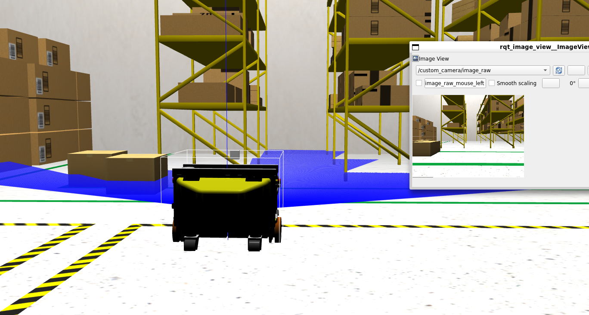
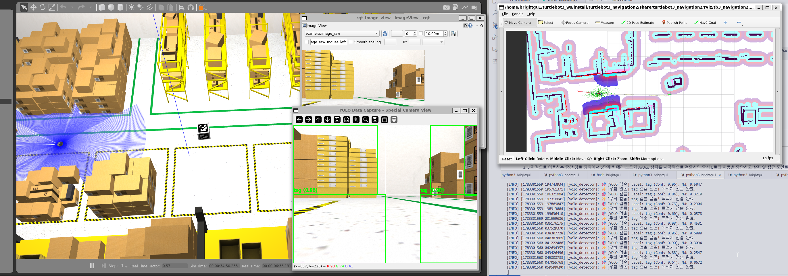
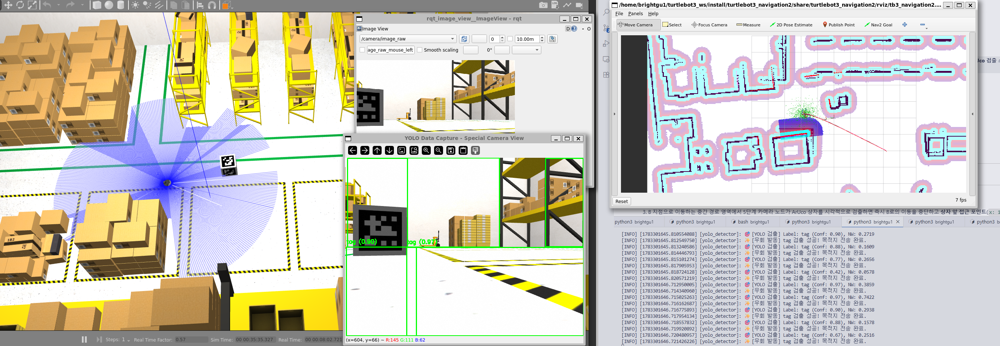

# 자율주행 로봇 기반 창고 자동화 시스템 (ROS 2 Humble)

## 프로젝트 개요

본 프로젝트는 ROS 2 Humble 기반의 자율주행 로봇(TurtleBot3 Waffle Pi)을 활용하여 가상 창고(Warehouse) 환경에서 물류 이송 작업을 수행하는 자동화 시스템임. 
로봇이 SLAM을 통해 실시간으로 환경 지도를 생성하고, 온보드 카메라와 비전 기술을 결합하여 장애물을 동적으로 탐지하며, 경로 상에 출현하는 물류 박스를 감지했을 때 실시간으로 경로를 선회(Preemption)하여 적재 후 최종 목적지까지 이동하도록 제어함.

---

## 🎯 핵심 자율주행 스토리라인

> ⚓ **"단순한 획일 노선 주행이 아닌, 실시간 변수에 대응하는 유연한 로봇 구현"**
> 
> 로봇이 적재 구역인 **A 지점**에서 하역 구역인 **B 지점**으로 경로 계획에 따라 주행하던 도중, 중간 통로 구역에서 미지의 물류 박스를 감지하면 주행 임무를 동적으로 취소하고 박스 앞 접근 포인트로 즉각 선회하여 박스를 파지(하드코딩 적재 모사)함. 적재 완료 후, 최종 목적지인 B 지점으로 경로를 실시간 재발행하여 임무를 완수함.

---

## 프로젝트 목표 및 상태

- **자율 주행**: 2D LiDAR 기반 SLAM 실시간 맵핑 및 위치 인식 (완료)
- **객체 인식**: 카메라 기반 ArUco 마커 및 YOLO 활용 다차원 박스 검출 (실험 및 튜닝 진행 중)
- **동적 제어**: 주행 중 물체 감지 시 실시간 경로 취소 및 우회 이동 제어 (완료)
- **최종 자동화**: 주행 중 물류 박스를 동적 감지하여 적재 후 B 지점으로 이동 (진행 중, 선반 이송은 보류)

---

## 1. 가상 물류창고 시뮬레이션 환경 구축



* **변경 사항**: TurtleBot3 기본 기본 맵 ➡️ 현실적인 3D 물류 창고(Warehouse) 환경
* **목적**: 더 입체적이고 음영이 뚜렷하며 통로가 협소한 실제 산업 창고 환경을 모사하여 자율주행 스택 검증

---

## 2. SLAM 기반 맵 생성 및 센서 이슈

### 문제점: 라이다 센서 스캔 편차 및 지도 왜곡 현상

| LiDAR 센서 감지 미스 및 지도 생성 오류 사례 |
| :---: |
|  |
|  |
|  |


* **발견된 문제**:
  - 라이다 센서에 의해 검출되지 않은 장애물(예: 투명한 벽, 매우 높은 위치의 물체)이 있는 공간으로 로봇이 지나갈 때 해당 영역이 지도에 표시되지 않음
  - 텅 빈 넓은 공간에서 지도가 온전히 그려지지 않거나 부분적으로 왜곡되는 현상 발생


* **원인 분석**:
  - 라이다는 2D 평면에서만 스캔하므로 고도 정보를 놓칠 수 있음
  - 특정 재질의 물체는 레이저 반사율이 낮아 감지되지 않을 수 있음
  - 로봇 이동 속도가 빠르면 센서 데이터 샘플링 부족

* **해결 시도**:
  - 로봇의 이동 속도를 최소화하고, 수동 텔레오프(Teleop) 제어로 빈 공간을 아주 천천히 탐색하며 Lidar 데이터 수집율을 극대화함
  - 2D 평면 스캔 범위의 물리적 한계로 완벽한 맵 생성이 지연되어 최종 지도 파일(`warehouse_map.yaml`)의 왜곡 보정 최적화를 지속 진행함

---

## 3. 경로 계획 및 내비게이션 최적화



* **N개 포인트 확장**: 로봇이 단일 경로뿐 아니라 A지점 ➡️ B지점 ➡️ 경유지를 아우르는 다중 웨이포인트를 순회하도록 제어 코드 확장
* **내비게이션 모순**: 맵상에 미처 그려지지 않은 일부 통로 구역도 Nav2의 동적 장애물 레이어(Local Costmap)가 실시간으로 빈 공간을 판단하여 안전하게 통과함을 검증함

---

## 4. 카메라 기반 객체 인식 및 ArUco 마커 디버깅



* **현재 상태**: 
  - 로봇의 카메라 뷰를 통해 박스 인식 성공적으로 확인
  - 기본적인 컴퓨터 비전 파이프라인 작동 중

<video controls src="assets/4_2.mp4" title="Title"></video>

---

## 5. 박스 분류 및 ArUco 마커 실험

### [실험 1] 초기 ArUco 마커 인식 시도와 실패
* 박스의 위치 식별 및 분류를 위해 ArUco 마커를 상자에 부착하여 추적 시도
* **실패 원인**:
  1. **초기 작은 마커 크기**: 카메라 해상도 문제로 인식률 불량
  2. **마커 확대 후에도 기각(Reject) 현상**: 마커를 키웠음에도 검출 실패

<video controls src="assets/5_1작은마커.mp4" title="Title"></video>

* 마커의 크기를 키웠으나 인식 실패 지속 발생

<video controls src="assets/5_2_마커확대.mp4" title="Title"></video>

### [실험 2] NumPy 2.x 충돌 및 WSL FPS 병목 진단
* **FPS 병목**: WSL GPU 가속 문제로 카메라 주기가 **0.6 ~ 0.8Hz**로 떨어져 이동 중 마커 검출 누락 발생  
  👉 **조치**: 소프트웨어 렌더링(`LIBGL_ALWAYS_SOFTWARE=1`)을 강제 적용해 **2.7Hz**로 FPS 상향 보정
* **NumPy 충돌**: 비전 라이브러리 설치 도중 NumPy 2.2.6으로 강제 업그레이드되어 ROS 2 Humble의 `cv_bridge`와 바인딩 에러(`_ARRAY_API not found`) 및 세그멘테이션 폴트 발생  
  👉 **조치**: Humble 호환용 `numpy<2.0.0` (1.26.4)으로 강제 다운그레이드 및 복구 수행

### [실험 3] Roboflow YOLOv8 클라우드 SDK 연동 실습
* ArUco의 대안으로 Roboflow 서버리스 API(`model_id: aruco-p8qoq/1`)를 연동하여 `tag` 클래스 검출 실험 진행
* **문제점**: 도메인 갭으로 인해 진짜 마커 박스 외에 창고 통로의 흰색 바닥, 빈 벽면 및 적재된 일반 노란색/갈색 선반 박스들을 무작위로 오검출하는 한계 확인 (아래 캡처 사진 참고)

| Roboflow YOLOv8 오검출 및 터미널 로그 사례 |
| :---: |
|  |
|  |


* **성과**: 로봇의 실시간 위치(`Odom`) 데이터를 트래킹하여 타겟 상자가 위치한 중심 진입로(`y: -3.0 ~ 2.0`) 내에 들어왔을 때만 카메라 API를 켜는 **위치 영역 필터링(Zone Gating)** 로직을 구현하여 오동작 최소화
* **향후 과제**: 오인식률 개선을 위해 추후 실제 데이터셋 기반의 로컬 YOLOv8 모델 파인튜닝(Fine-tuning) 계획

### [실험 4] 로컬 ArUco 노드로의 최종 롤백 및 보완 (최종 채택)
1. **마진 비율 보정**: 마커 생성 스크립트의 30% 마진 비율 오류로 판독 실패가 났음을 확인하여 마진을 **10%**로 재규격화 후 상자 텍스처 갱신 수행
2. **딕셔너리 규격 교정**: 4x4 데이터 비트 및 6x6 전체 격자에 맞는 표준 **`DICT_6X6_250`**으로 딕셔너리를 재원복하여 오인식 제거
3. **지연 시간 제거**: 과거 프레임이 큐에 쌓여 검출 반응 속도가 밀리던 문제를 **구독자 버퍼 크기를 1(`Queue: 1`)**로 축소 설정해 해결함

---

## 🛠️ 향후 개발 계획

### Phase 1: 단기 개발 및 보완
- [x] 가상 창고 환경 구축 및 라이다 SLAM 맵 생성
- [x] Odom 연동 카메라 비전 노이즈 게이팅 처리
- [x] Nav2 우회/선회 동적 미션 매니저 주행 구현
- [ ] ArUco 마커 검출 정확도 및 감도 정밀 튜닝

### Phase 2: 최종 목표 🎯
- [ ] **동적 박스 이송 자동화 시스템 구축**: 로봇이 주행로 상에서 마커 박스를 강건하게 탐지하여, 픽업(적재) 후 B 지점으로 안전하게 자율 운반하는 통합 시나리오 완성

---

## 기술 스택
- **OS & 프레임워크**: ROS 2 Humble, Ubuntu 22.04 LTS
- **내비게이션**: ROS 2 Nav2 스택 (Simple Commander API 사용)
- **컴퓨터 비전**: OpenCV 4.x, Roboflow Inference SDK (실습)
- **마커 인식**: 적응형 CLAHE 필터 및 Odom 게이팅을 결합한 ArUco (`DICT_6X6_250`)
- **프로그래밍**: Python 3.10, C++

---

## 파일 구조
```
├── README.md                 # 본 문서
├── aruco_detector.py         # Odom 게이팅 적용 ArUco 감지 노드
├── tb3_nav_waypoint.py       # 동적 선회 FSM 주행 제어 스크립트
├── map/                      # 맵 및 설정 파일 (.yaml, .pgm)
├── assets/                   # 프로젝트 미디어 저장소
├── m13_ws/                   # ROS 2 capstone workspace
└── turtlebot3_ws/            # TurtleBot3 Waffle Pi 공식 패키지
```
