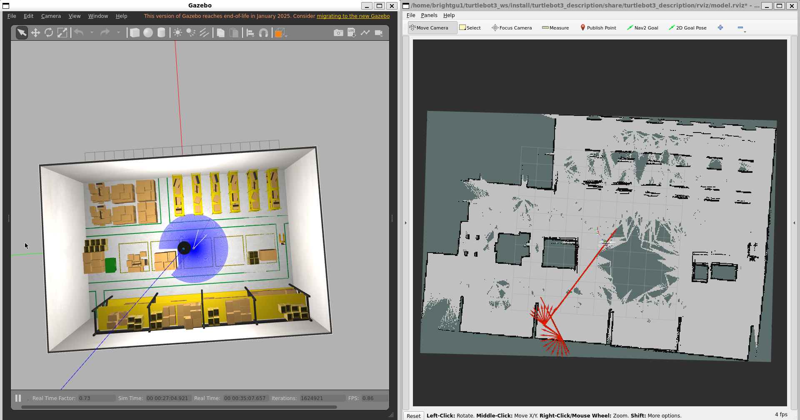
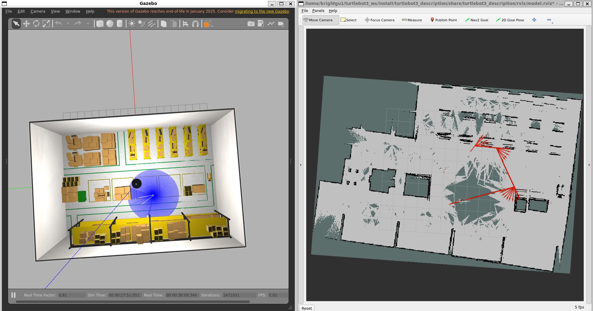
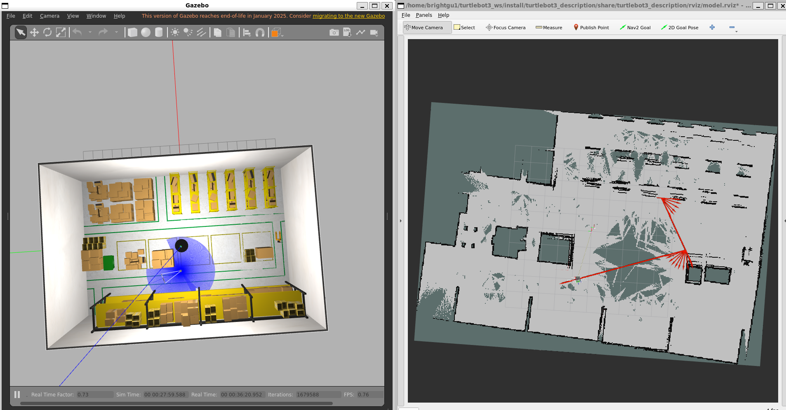
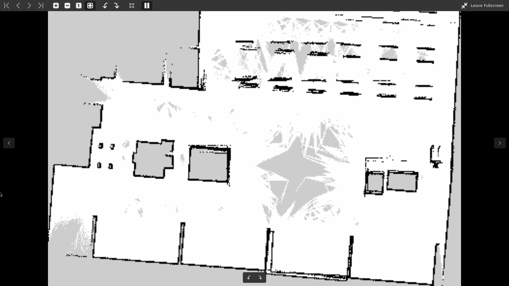

# 자율주행 로봇 기반 창고 자동화 시스템

## 프로젝트 개요

본 프로젝트는 ROS 2 기반의 자율주행 로봇을 활용하여 창고 환경에서 박스 적재함 이동 작업을 자동화하는 시스템입니다. 로봇이 라이다 센서를 통해 환경 지도를 생성하고, 카메라를 활용하여 박스를 인식 및 분류한 후, 자동으로 경로를 계획하여 작업을 수행합니다.

## 프로젝트 목표

- ✅ **자율 주행**: SLAM을 활용한 실시간 맵핑 및 위치 인식
- ✅ **객체 인식**: 카메라 기반 박스 및 물체 검출
- ✅ **경로 계획**: 동적 장애물 회피 및 최적 경로 생성
- 🔄 **자동화 작업**: 선반 기반 적재함 픽업 및 이동 (개발 중)

---

## 1. 시뮬레이션 환경 업그레이드


**변경 사항: Turtle Bot 3 환경 → Warehouse 환경**

- **기존**: 단순한 터틀봇 기본 환경에서 테스트
- **개선**: 실제 창고 시나리오를 반영한 warehouse 환경으로 전환
- **목적**: 더 현실적인 복잡도의 환경에서 로봇 성능 검증

---

## 2. SLAM 기반 맵 생성 및 센서 이슈

### 문제점: 라이다 센서 감지 미스





**발견된 문제**:
- 라이다 센서에 의해 검출되지 않은 장애물(예: 투명한 벽, 매우 높은 위치의 물체)이 있는 공간으로 로봇이 지나갈 때 해당 영역이 지도에 표시되지 않음
- 센서 커버리지의 한계로 인한 불완전한 맵 생성



**원인 분석**:
- 라이다는 2D 평면에서만 스캔하므로 고도 정보를 놓칠 수 있음
- 특정 재질의 물체는 레이저 반사율이 낮아 감지되지 않을 수 있음
- 로봇 이동 속도가 빠르면 센서 데이터 샘플링 부족

---

## 3. 경로 계획 및 내비게이션 모순


**관찰된 현상**:
- 지도상에 표시되지 않은 영역도 로봇의 내비게이션 스택이 성공적으로 경로를 통과함
- 실제로 로봇은 해당 공간을 빈 공간으로 올바르게 인식하고 있음

**분석**:
- 센서 퓨전 및 동적 장애물 감지가 지도 생성보다 효과적으로 작동 중
- 지도의 정확성 문제가 실제 네비게이션 성능에 미치는 영향은 제한적

**개선 계획** (진행 중):
- 로봇 이동 속도 감소 → 센서 데이터 샘플링 증가
- 로그 추적을 통한 센서-맵핑 알고리즘 최적화
- 센서 퓨전 파라미터 튜닝

---

## 4. 카메라 기반 객체 인식


**현재 상태**: 
- 로봇의 카메라 뷰를 통해 박스 인식 성공적으로 확인됨
- 기본적인 컴퓨터 비전 파이프라인 작동 중

<video controls src="screenshot/4_2.mp4" title="Title"></video>

---

## 5. 박스 분류 및 ArUco 마커 실험

### 초기 시도: ArUco 마커 기반 인식

**접근 방식**:
- 박스와 다른 물체들을 구분하기 위해 상자에 ArUco 마커(QR 코드 형태의 마커) 부착
- 마커 기반 정확한 위치 추적 및 분류 기대

**문제점**:
- ❌ 마커 인식률 저하 (인식이 잘 안 됨)
- ❌ 로봇 이동 시 진동으로 인한 카메라 흔들림
- ❌ 조명 변화에 따른 인식 성능 불안정

### 대안 기술 검토

**1) YOLO 기반 박스 인식**
- 딥러닝 모델을 통한 박스 검출
- 조명, 각도, 변형에 더 강건함
- 학습 데이터셋 구성 필요

**2) YOLO를 통한 로봇 이동 경로 추적**
- 로봇이 이동한 경로를 자동으로 학습하고 인식
- 향후 반복 작업 시 패턴 인식 활용
- 더 높은 수준의 자동화 달성 가능

---

## 6. 향후 개발 계획

### Phase 1: 현재 진행 중
- [x] Warehouse 환경 셋업
- [x] 라이다 기반 SLAM 구현
- [x] 카메라 기반 객체 감지
- [ ] 센서 이슈 해결 및 최적화

### Phase 2: 단기 목표 (2-4주)
- [ ] YOLO 모델 학습 및 통합
- [ ] 박스 정확 인식 시스템 구축
- [ ] 네비게이션 알고리즘 최적화

### Phase 3: 최종 목표 🎯
- [ ] **선반 기반 픽업 시스템 구축**
  - 로봇이 박스를 개별적으로 잡는 것이 아닌, 적재함 아래의 **선반 자체를 들어올려 이동**
  - 창고 작업 효율성 극대화
  - 실제 운영 환경에 맞게 설계된 자동화 프로세스

---

## 기술 스택

- **OS & 프레임워크**: ROS 2, Ubuntu
- **SLAM**: 라이다 센서 기반 맵 생성
- **내비게이션**: ROS 2 Nav2 스택
- **컴퓨터 비전**: OpenCV, YOLO (계획)
- **마커 인식**: ArUco (실험 중)
- **프로그래밍**: Python, C++

---

## 파일 구조

```
├── README.md                 # 본 문서
├── aruco_detector.py         # ArUco 마커 감지 스크립트
├── nav_waypoint.py           # 웨이포인트 기반 내비게이션
├── map/                      # 맵 파일 저장소
├── screenshot/               # 프로젝트 진행 과정 이미지/비디오
├── m13_ws/                   # ROS 2 작업 공간
├── capstone_student/         # 캡스톤 프로젝트 관련 파일
└── turtlebot3_ws/            # 터틀봇 관련 작업 공간
```

---

## 참고 자료 및 문서

- [ROS 2 공식 문서](https://docs.ros.org/)
- [Nav2 내비게이션 스택](https://nav2.org/)
- [YOLO 객체 인식](https://github.com/ultralytics/yolov5)
- 자세한 절차는 `capstone_student/` 폴더의 가이드 문서 참고