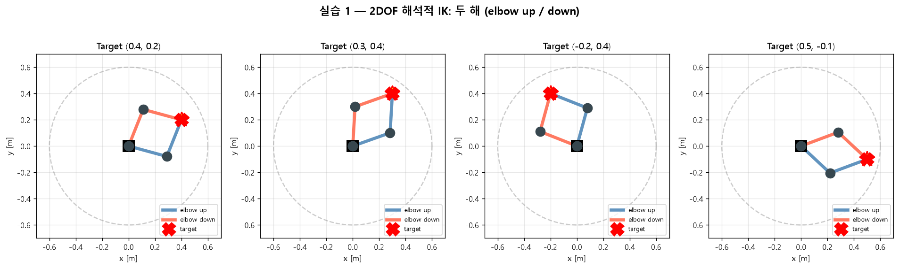
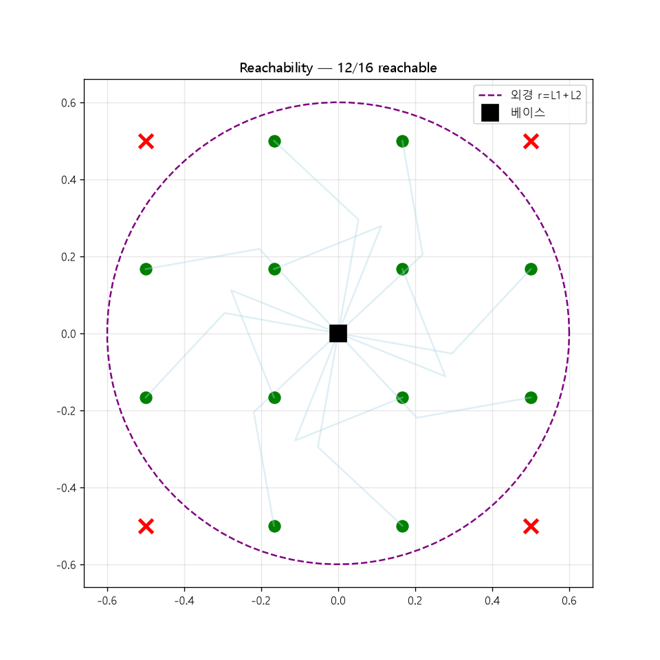
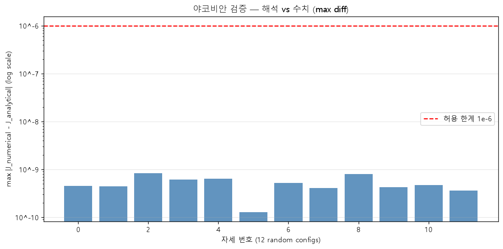
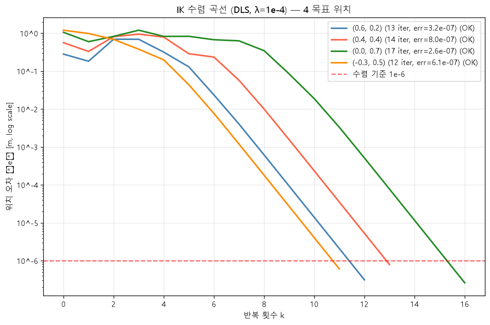
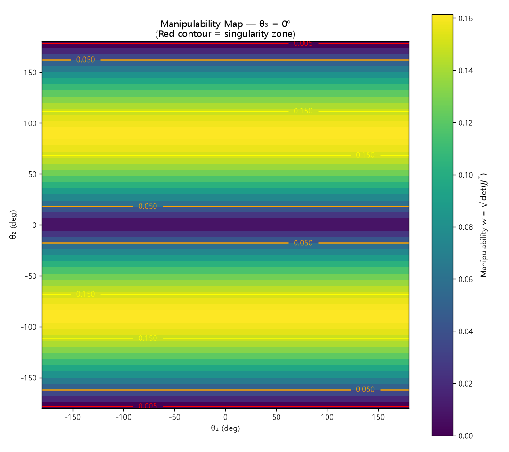
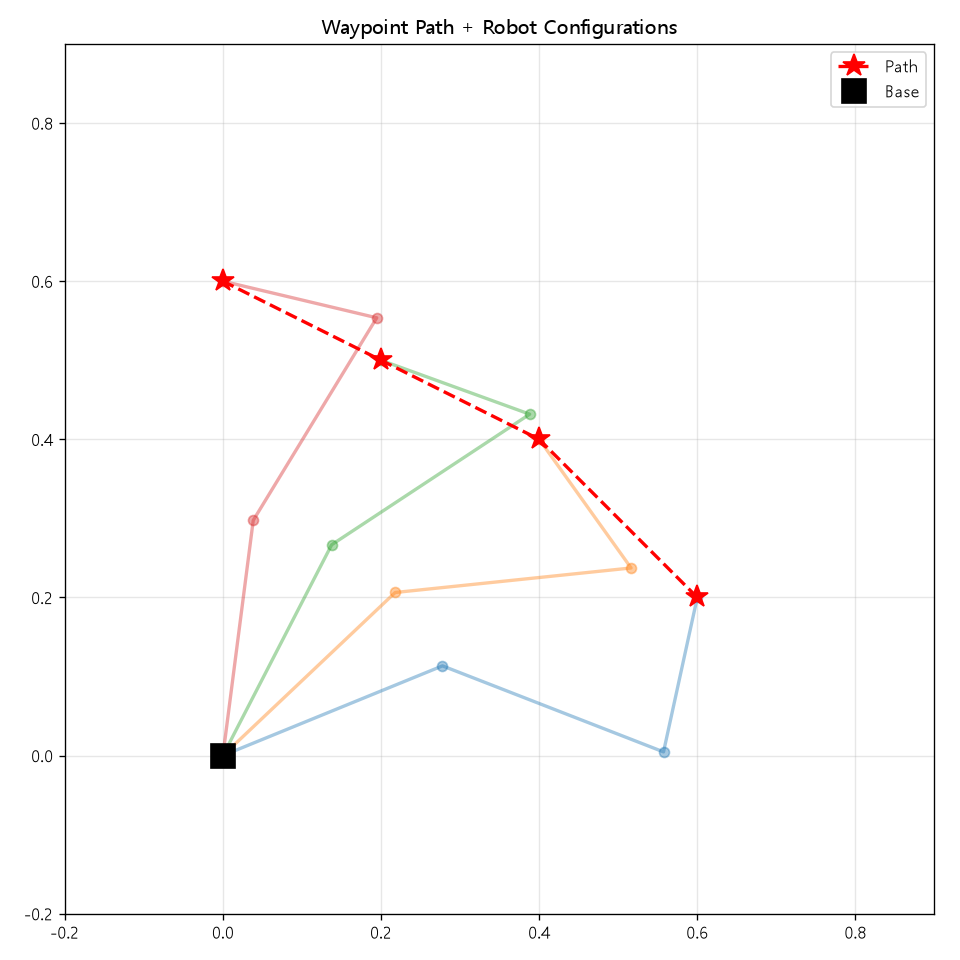
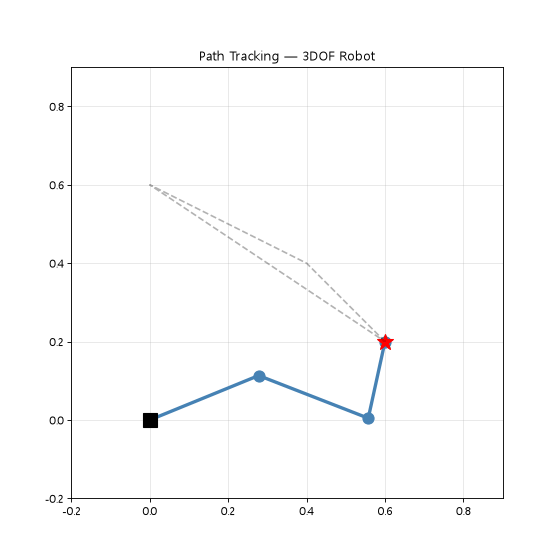
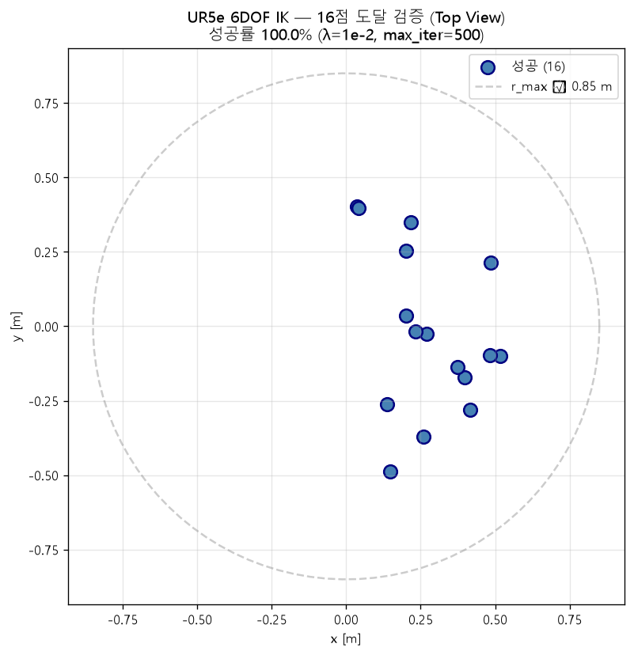

# 로봇 공학 실습 리포트

---

## [노트북 실습] 좌표계 변환 기초

### 학습 목표
동차 변환 행렬(Homogeneous Transformation Matrix)을 이해하고, 기준 좌표계(Base Frame)를 기준으로 다양한 변환(이동 및 회전)을 거친 좌표계의 위치와 방향을 계산하고 시각화한다.

### 설명
2차원 및 3차원 공간에서 회전 변환과 평행이동 변환을 결합한 동차 변환 행렬을 생성하고 적용한다. 기준 좌표계에 대해 변화된 각 좌표 프레임의 위치와 x, y축 방향 벡터를 그래프 상에 도시하여 좌표계 간의 상대적인 기하학적 관계를 파악한다.

### 소스
* [01_coordinate_transforms.ipynb](my_nd1_m7/notebooks/01_coordinate_transforms.ipynb)

### 결과(이미지)

* **이미지 설명**: 기준 좌표계(Base Frame)에 대해 평행이동 및 회전 변환을 거쳐 정의된 세 가지 로컬 좌표계(Frame 1, 2, 3)의 위치와 각 좌표축 방향 벡터(x축: 빨간색, y축: 녹색)의 기하학적 관계를 시각화한 결과이다.

---

## 실습 1: 2DOF 평면 로봇의 기구학 및 해석적 역기구학

### [노트북 실습] 2DOF 정기구학 및 작업 공간 시각화
#### 학습 목표
정기구학(Forward Kinematics)을 바탕으로 2자유도 로봇 팔의 관절 공간(Joint Space)과 작업 공간(Workspace) 간의 사상(Mapping) 관계를 이해하고 시각화한다.
#### 설명
두 개의 관절각($\theta_1, \theta_2$) 범위를 격자 형태로 전수 조사하여 정기구학 수식으로 말단 작동기(End-effector)의 위치를 계산한다. 관절의 운동 범위 한계 내에서 로봇 팔이 도달할 수 있는 전체 작업 공간(Workspace)을 점군(Point Cloud) 형태로 시각화하고 링크 길이에 따른 물리적 경계를 파악한다.
#### 소스
* [02_2dof_forward_kinematics.ipynb](my_nd1_m7/notebooks/02_2dof_forward_kinematics.ipynb)
#### 결과(이미지)

* **이미지 설명**: 두 관절의 회전 각도 제한이 없을 때($0 \le \theta_1, \theta_2 \le 2\pi$), 두 링크 길이의 합을 반지름으로 하여 형성되는 도넛 형태의 2자유도 평면 로봇 팔 전체 도달 작업 공간(Workspace)을 점군으로 나타낸 결과이다.

* **이미지 설명**: 관절 각도 범위에 물리적 한계 제한(예: $-\pi/2 \le \theta_1 \le \pi/2$, $0 \le \theta_2 \le \pi$)을 부여했을 때, 비대칭적으로 좁아진 로봇 팔의 실제 구동 가능한 작업 공간 범위를 시각화하여 관절 제약 조건의 영향을 분석한 결과이다.

### [노트북 실습] 2DOF 해석적 역기구학 및 궤적 추적
#### 학습 목표
2자유도 평면 로봇의 해석적 역기구학(Analytical IK) 식을 활용하여 작업 공간 내 원형 궤적(Circle Trajectory)을 실시간으로 추적하고 관절각의 변화 특성을 분석한다.
#### 설명
말단 작동기가 원형 경로를 따라 연속적으로 이동할 때의 목표 좌표에 대응하는 두 관절각 해를 해석적인 방법으로 연산한다. 시간에 따른 말단 작동기의 추적 궤적과 관절각의 부드러운 변화 추이(Joint Angles Transition)를 그래프로 분석하여 기구학적 특성을 검증한다.
#### 소스
* [03_2dof_inverse_kinematics.ipynb](my_nd1_m7/notebooks/03_2dof_inverse_kinematics.ipynb)
#### 결과(이미지)

* **이미지 설명**: 2자유도 로봇 팔이 작업 공간 내에 설정된 파란색 점선의 원형 경로(Trajectory)를 추종하는 동안 링크와 관절이 배치되는 물리적 움직임 형상을 평면상에 실시간으로 중첩 시각화한 결과이다.

* **이미지 설명**: 원형 경로를 연속적으로 추종함에 따라 시간에 비례하는 타임스텝 동안 두 관절각 $\theta_1$(파란색)과 $\theta_2$(주황색)가 급격한 불연속성 없이 부드럽게 주기적으로 변화하는 흐름을 보여주는 시간 응답 그래프이다.

### [파이썬 스크립트 실습] 2DOF 역기구학 해 비교 및 도달 범위 검증
#### 학습 목표
2자유도 평면 로봇 팔의 두 가지 역기구학 해(Elbow Up, Elbow Down)를 수식으로 계산하고 목표 도달 가능성을 격자로 검증한다.
#### 설명
코사인 법칙을 통해 두 가지 관절각 해를 도출하고 두 자세를 비교 시각화한다. 또한, 작업 공간 내 16개의 격자점을 생성하여 로봇의 실제 도달 가능 여부와 구조적 한계 영역을 검증한다.
#### 소스
* [lab1_step3_two_solutions.py](my_nd1_m7/scripts/lab1_step3_two_solutions.py)
* [lab1_step4_validation.py](my_nd1_m7/scripts/lab1_step4_validation.py)
* [ik_analytical.py](my_nd1_m7/src/ik_analytical.py)
#### 결과(이미지)

* **이미지 설명**: 하나의 목표 지점(빨간 별)에 도달하기 위해 삼각함수로 구한 두 가지 해인 Elbow-Up 자세(파란색 실선)와 Elbow-Down 자세(녹색 점선)를 시각적으로 중첩하여 대칭적인 관절 해의 분포를 증명한 결과이다.

* **이미지 설명**: 평면에 배치된 16개의 목표 위치(격자점)에 대해 역기구학 연산을 수행하여, 물리적으로 도달 가능한 영역(성공: 파란색 원 및 O 표시)과 링크 길이 한계 등으로 도달할 수 없는 영역(실패: 빨간색 X 표시)을 작업 공간 상에 검증한 결과이다.

---

## 실습 2: 3DOF 수치적 역기구학과 야코비안 검증

### 학습 목표
3자유도 로봇 팔의 야코비안(Jacobian) 행렬을 검증하고, DLS(감쇠 최소자승법) 수치 역기구학을 적용한다.

### 설명
수치적 미분 방법과 수식을 통한 해석적 방법으로 구한 야코비안 행렬의 오차를 비교하여 정확성을 교차 검증한다. 특이점에서 역행렬이 폭발하는 것을 방지하는 DLS 알고리즘을 이용해 로봇 팔이 4개의 목표점을 안정적으로 추적하는 과정을 구현한다.

### 소스
* [lab2_step1_jacobian_check.py](my_nd1_m7/scripts/lab2_step1_jacobian_check.py)
* [lab2_step4_4poses.py](my_nd1_m7/scripts/lab2_step4_4poses.py)
* [lab2_pbl_main.py](my_nd1_m7/scripts/lab2_pbl_main.py)

### 결과(이미지)

* **이미지 설명**: 미소 변위를 이용한 수치 미분 야코비안 행렬과 편미분 공식으로 유도한 해석적 야코비안 행렬 간의 원소별 차이(Absolute Error)를 나타낸 히트맵으로, 오차가 거의 제로($10^{-9}$ 이하)에 수렴하여 야코비안 연산식의 유효성을 검증한 결과이다.

* **이미지 설명**: 3자유도 로봇 팔이 3차원 상태 공간상의 평면 4개 목표 지점을 DLS 기반 수치 역기구학을 사용해 각 타겟 좌표로 순차적으로 이동하고 최종 도달하여 안정된 팔 형상을 유지하고 있음을 보여주는 다중 목표 추적 결과이다.

* **이미지 설명**: 수치 해석(Newton-Raphson 기반 DLS) 과정에서 루프 반복 횟수(Iteration)에 따른 목표 위치와 말단 장치 간의 거리 오차(Position Error) 추이를 보여주는 그래프로, 세부 타겟 포즈에 대해 약 10회 반복 이내에 오차가 오차 허용값($10^{-6}$) 이하로 지수 수렴함을 분석한 결과이다.

---

## 실습 3: 조작성 지수 시각화 및 연속 경로 제어

### [노트북 실습] 3DOF 로봇 조작성 히트맵 시각화
#### 학습 목표
3자유도 로봇 팔의 자코비안 행렬을 기초로 Yoshikawa 조작성 지수(Manipulability Index)를 정의하고, 작업 공간 내 위치에 따른 조작 성능을 시각화한다.
#### 설명
3자유도 평면 로봇의 전체 도달 가능 작업 공간을 그리드로 나누어 각 위치에서의 조작성 지수를 연산한다. 이를 열지도(Heatmap) 형태로 표현하여 로봇 팔의 움직임이 자유로운 최적의 작업 영역(높은 조작성 지수)과 특이점 지대(0에 가까운 조작성 지수)의 공간적 분포를 시각적으로 분석한다.
#### 소스
* [04_3dof_kinematics_and_jacobian.ipynb](my_nd1_m7/notebooks/04_3dof_kinematics_and_jacobian.ipynb)
#### 결과(이미지)

* **이미지 설명**: 말단의 x, y 좌표 평면 상에서 로봇 팔이 가질 수 있는 Yoshikawa 조작성 지수($w = \sqrt{\det(JJ^T)}$)를 색상의 밝기(히트맵)로 투영하여, 중심부에 가까울수록 움직임의 유연성(Manipulability)이 크고 외부 경계 영역 및 원점 부근으로 갈수록 0에 수렴하는 현상을 분석한 결과이다.

### [파이썬 스크립트 실습] 조작성 분석 및 특이점 회피 연속 경로 제어
#### 학습 목표
조작성 지형도의 등고선과 구배(Gradient)를 분석하여 특이점을 회피하고, 연속 역기구학(Continuous IK)을 통해 안정적인 다중 경로 추적을 달성한다.
#### 설명
관절 공간 격자 분석을 기반으로 등고선형 조작성 지형도를 그려 특이점 경계를 도출한다. 경로점 추적 시 이전 상태의 관절각을 다음 연산의 수치 해석 초기값으로 지정함으로써, 급격한 관절 모션 점프를 방지하고 부드러운 이동 경로를 구현한다. (시각화 애니메이션 포함)
#### 소스
* [lab3_step1_waypoints.py](my_nd1_m7/scripts/lab3_step1_waypoints.py)
* [lab3_step2_manipulability.py](my_nd1_m7/scripts/lab3_step2_manipulability.py)
* [lab3_step3_singularity_compare.py](my_nd1_m7/scripts/lab3_step3_singularity_compare.py)
* [lab3_step4_animation.py](my_nd1_m7/scripts/lab3_step4_animation.py)
#### 결과(이미지)

* **이미지 설명**: 관절각 공간($\theta_2, \theta_3$) 그리드 전역에 대해 계산한 조작성 지수를 2D 등고선(Contour) 지형도로 표현하고, 조작성이 최소화되는 지점(특이점 지대: 검은 점선 영역)과 최대 가동성을 확보하는 관절각 영역의 경계를 도출한 시각화 결과이다.

* **이미지 설명**: 직전 관절 자세를 역기구학 초기값으로 피드백하는 연속 IK 방식을 적용하여, 말단 작동기가 설정된 복잡한 형상의 다중 경로점(Waypoints) 궤적을 오차 없이 정확하고 부드럽게 추종하며 그려낸 주행 궤적 그래프이다.

* **이미지 설명**: 로봇 팔이 특이점 지대에 인접한 경로를 통과할 때, 특이점 우회 알고리즘(Damped Least Squares 등)을 적용하지 않았을 경우 발생하는 오차 급증 현상(Pseudo-inverse 발산)과 특이점 회피 제어가 결합되어 안정적으로 오차를 억제한 제어 성능을 비교한 오차 분석 그래프이다.

* **이미지 설명**: 말단 작동기가 다중 경로점을 실시간으로 부드럽게 순회 주행하는 동안, 3DOF 로봇 팔의 3개 링크와 3개 회전 관절이 매끄러운 굴절 동작으로 경로를 따라가는 역동적인 기구학적 기동 과정을 시각화한 애니메이션 파일이다.

---

## 실습 4: 칼만 필터 및 6DOF 3D 공간 확장

### 학습 목표
칼만 필터(Kalman Filter)를 도입하여 노이즈가 포함된 궤적을 보정하고, 역기구학 개념을 3D 공간의 6자유도 다관절 로봇으로 확장한다.

### 설명
등속 운동 모델과 센서 측정 모델을 확률적으로 융합하여 관측 노이즈를 필터링(Smoothing)하고 예측 경로의 신뢰성을 높인다. 3차원 공간상에서 6DOF 로봇의 16개 격자점 도달 여부를 테스트하여, 평면 제어를 넘어서는 물리적 확장성을 검증한다.

### 소스
* [lab4_kalman_estimation.py](my_nd1_m7/scripts/lab4_kalman_estimation.py)
* [lab4_extension_6dof.py](my_nd1_m7/scripts/lab4_extension_6dof.py)

### 결과(이미지)

* **이미지 설명**: 가우시안 측정 노이즈로 인해 크게 흔들리는 1차원 센서 위치 측정값(빨간 점)으로부터 칼만 필터의 시스템 예측-보정 과정을 통해 노이즈가 스무딩되어 본래의 참값(검은 실선)에 고도로 수렴 추정된 경로(파란 실선)를 나타내는 1D 상태 추정 그래프이다.

* **이미지 설명**: 2차원 평면 궤적 상에서 노이즈가 포함되어 일그러진 관측 경로를 칼만 필터(KF) 알고리즘을 사용해 위치 데이터를 필터링하고 원래의 매끄러운 2D 이동 경로 궤적으로 정밀 복원해 낸 측정 성능 분석 그래프이다.

* **이미지 설명**: 3차원 입체 공간에서 6자유도(6DOF) 다관절 로봇 팔의 임의의 관절각 조합을 난수로 대량 생성하여, 말단 작동기가 공간 상에 도달할 수 있는 모든 위치(3D Coordinates)를 3차원 구형 형태의 점군 데이터로 도식화한 입체 작업 공간 분포도이다.
